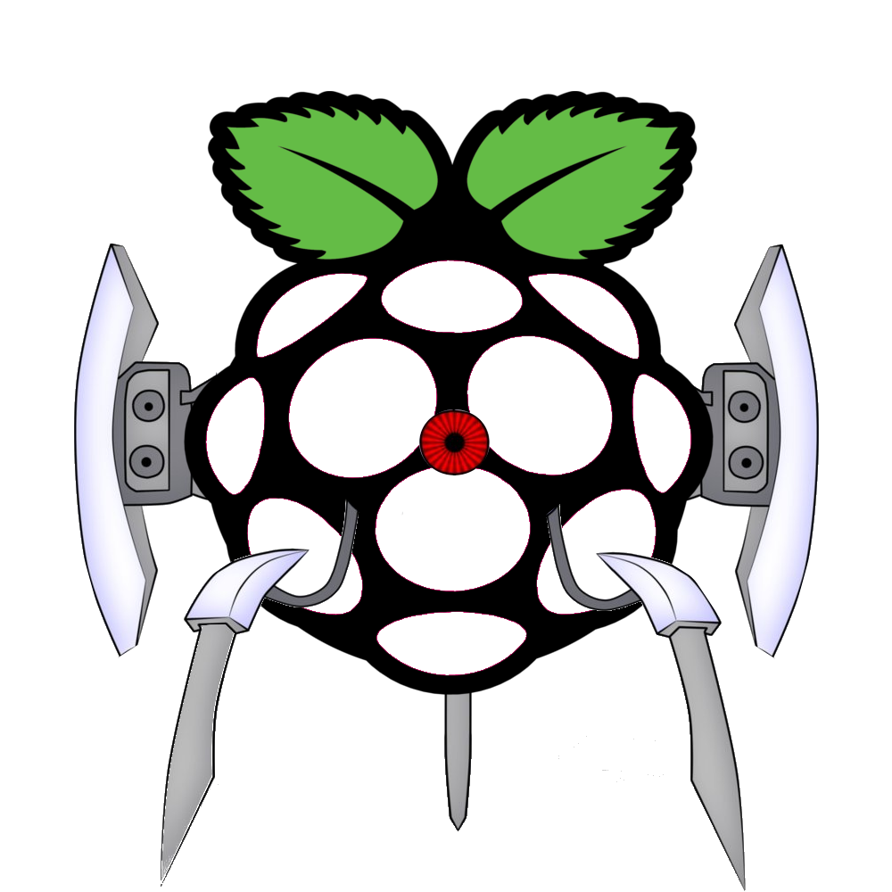

## Description

Smart presence detection device similar to a turrent from Portal.

On detection, turret will speak, shoot and vibrate.

RaspTurret PI, aPIrture science, turretberry PI

    The project was paused waiting for a proper 3D printed case , but never finished

## Hardware

* Raspberry PI
* PIR (Passive InfrarRed) sensor http://tinyurl.com/oo7twkk
* Vibrator (From PS2 old controller)
* Small Speaker for Raspberry (Veho 360) http://tinyurl.com/kqk6wkx
* Red led

## Software

* Python (repos)
* python-dev (repos)
* Python GPIO 0.5.2 http://tinyurl.com/lm58q4a

## Tutorials

* GPIO and python http://tinyurl.com/lm58q4a
* PIR Sensors and the Raspberry Pi http://tinyurl.com/banqxbq
* Accelerometer with a raspberry pi http://tinyurl.com/o2lmwxn
